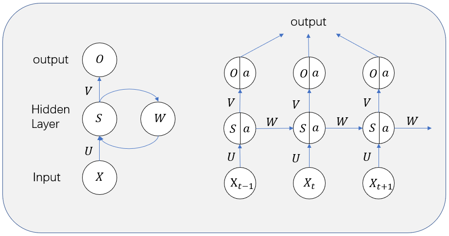

# *MLP (Multiple Layer Perceptron)*

*Back Propagation:*

$\delta^L$ =  $\nabla_a C\odot\sigma^{'} (Z^L)$

$\delta^l$ =  $((W^{l+1})^{T}\delta^{l+1})\odot\sigma^{'} (Z^l)$

$\frac{\partial C}{\partial W_{jk}^l}$ = $a_k^{l-1}\delta_j^l$

$\frac{\partial C}{\partial b^l}$ = $\delta_j^l$

# *RNN (Recurrent Neural Network)*

# *LSTM (Long Short-Term Memory)*
*Back Propagation Through Time*

# *GRU (Gate Recurrent Unit)*

*Back Propagation Through Time*

